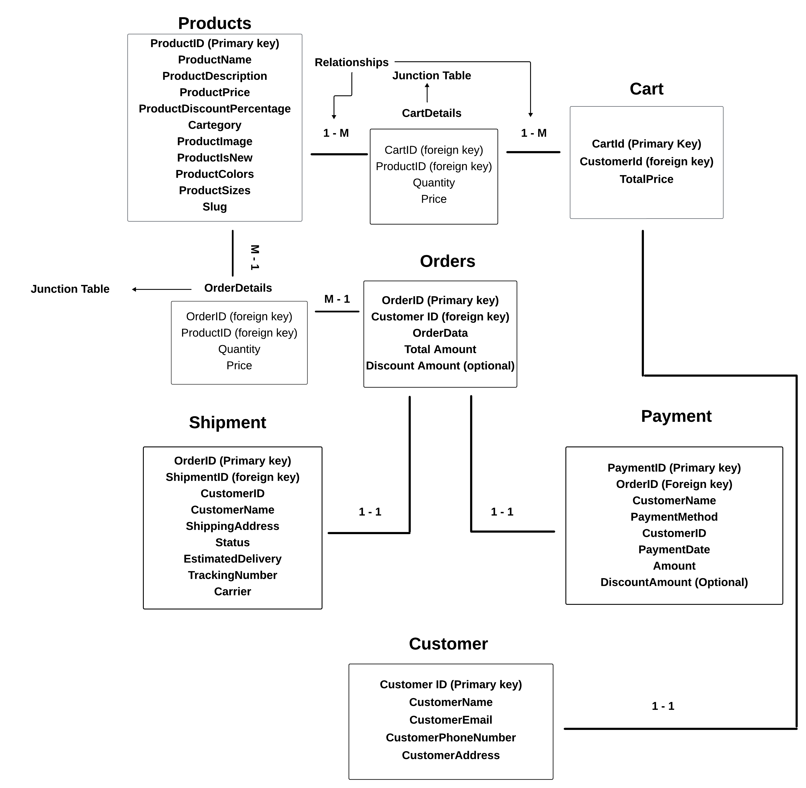

# **Marketplace Builder "General E-Commerce Website" Full Documentation**

## **Primary Purpose for Choosing This E-Commerce**

The basic purpose of choosing this e-commerce platform is to sell a wide variety of products across different categories. Unlike specialized stores or short-term rental services, our goal is to provide a broad range of products for everyday use.

## **My Business Goals**

### 1. What Problem Does Your Marketplace Aim to Solve?

Our aim is to save people time by eliminating the need to shop in malls. Everything necessary for daily life, such as clothing, groceries, and electronics, will be available on a single website.

### 2. Who Is Your Target Audience?

Our target audience consists of individuals who lack the time to shop in person and prefer home delivery, particularly business professionals and elderly people.

### 3. What Products or Services Will You Offer?

We offer a wide range of products including:

- Food items: Vegetables, meat, snacks, beverages, and more.
- Clothing: Men's, women's, and children's apparel.
- Electronics, furniture, and other home-related items.

Our services include:

- Cash on delivery and online transactions.
- Easy return process if the requirements are met.
- Competitive pricing and discounts on bulk purchases.

### 4. What Will Set Your Marketplace Apart?

- **Trust:** Ensuring that products are delivered accurately and with proper packaging.
- **Speed:** Fast delivery of orders.
- **Exchange:** Guarantee of product exchange if requirements are met.
- **Suitable Price:** Providing the best possible prices for every product.

## **Data Schemas**

Our website will include schemas for:

1. **Products:** To store product data.
2. **Orders:** For storing all order information.
3. **Customers:** To store customer information.
4. **Shipment:** To manage shipping options.
5. **Payment:** For handling payment methods.
6. **Cart:** For storing cart data.

## **Data Schemas Chart**

## **Frontend Requirements**

### 1. Landing Page

- Create an attractive and engaging landing page designed to capture user interest.
- Use a light color theme, avoiding overly dark designs, to ensure a pleasant user experience.

### 2. Design and Responsiveness

- Ensure all elements are clearly visible, well-organized, and intuitive.
- Implement a fully responsive design to guarantee optimal viewing across different devices and screen sizes.

### Navbar

- Include a search bar in the navbar to allow users to quickly find products.

### 3. Product Card Component

- Add a "Product Details" button in the product card component for easy access to detailed product information.

### 4. Pages and Navigation

- Develop three primary pages for the website:
  - **Clothing**
  - **Groceries**
  - **Electronics**

## **Backend Requirements**

### 1. Headless CMS

- Use Sanity as the headless CMS for managing backend data storage.

### 2. Schema Creation

- Create detailed schemas to handle various aspects of the e-commerce site:
  - **Products**
  - **Cart**
  - **Shipment**
  - **Payment**
  - **Orders**
  - **Customers**

### 3. User Authentication

- Use Clerk for user authentication. If Clerk’s services do not meet the requirements, create two schemas for managing user sign-up and log-in functionalities.

## **Third-Party APIs**

### 1. Shipment and Tracking

- Integrate ShipEngine API to handle shipment processes and tracking.

### 2. Payment Gateway

- Integrate a reliable payment gateway (e.g., Stripe, PayPal) to manage payments securely and efficiently.

# **System Archietecture Diagram**

